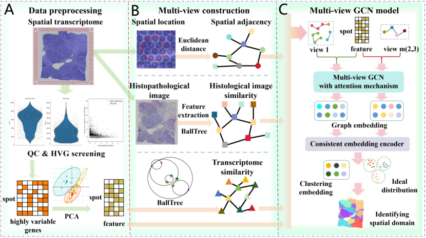

# MVST: Identifying spatial domains of spatial transcriptomes from multiple views using multi-view graph convolutional networks
## Description

Source code for ''MVST: Identifying spatial domains of spatial transcriptomes from multiple views using multi-view graph convolutional networks".

## Workflow

Workflow of MVST. (A) MVST uses Scanpy to perform routine data preprocessing operations such as quality control and highly variable gene screening on spatial transcriptome gene expression data, and uses PCA to downscale highly variable gene expression data to obtain a relatively low-dimensional feature representation of spot gene expression data. (B)The graph construction process of MVST reflects its multi-perspective feature, constructing graphs based on distance similarity, histopathological image similarity and gene expression similarity, respectively, so as to obtain spatial adjacency network, histological image similarity network and gene expression similarity network. (C) The multiview graph convolution model of MVST includes a multiview graph convolution encoder with an attention mechanism and a coherent embedding encoder, in which the multiview graph convolution encoder learns the spot features from each of the three views, and the coherent embedding encoder integrates the features of the spot in each view to obtain the final clustered embedding.

## Requirements

- python (3.8.17)
- tensorflow(2.9.1)
- networkx(2.8.4)
- scipy(1.10.1)
- scanpy(1.9.3)
- skimage(0.19.3)
- pandas (2.0.3)
- numpy (1.24.3)
- sklearn (1.3.0)

## Installation

All packages can be installed via pip (https://pypi.org/project/pip/). Generally, a couple of minutes is needed for installing each package.

**e.g.** pip install sklearn

## Identifying the spatial domain of spatial transcriptome data

- The '. /code' folder provides the code to build a  model for identifying the spatial domain of spatial transcriptome data.
